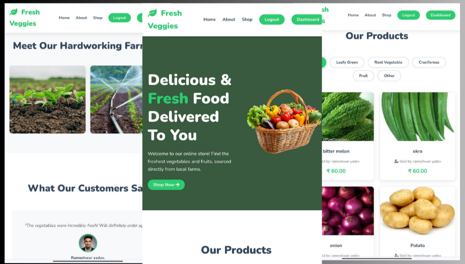
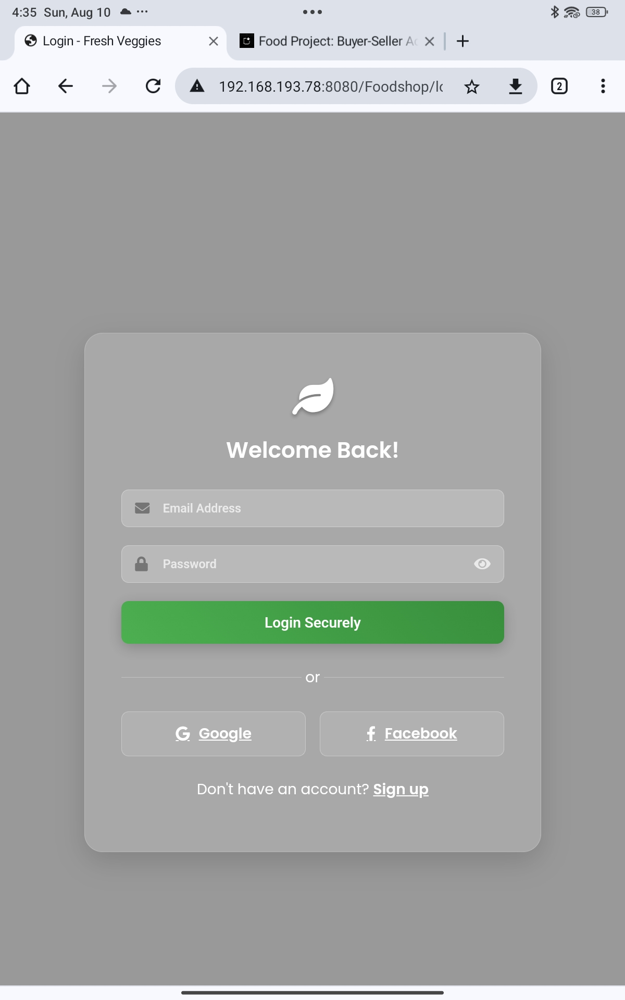
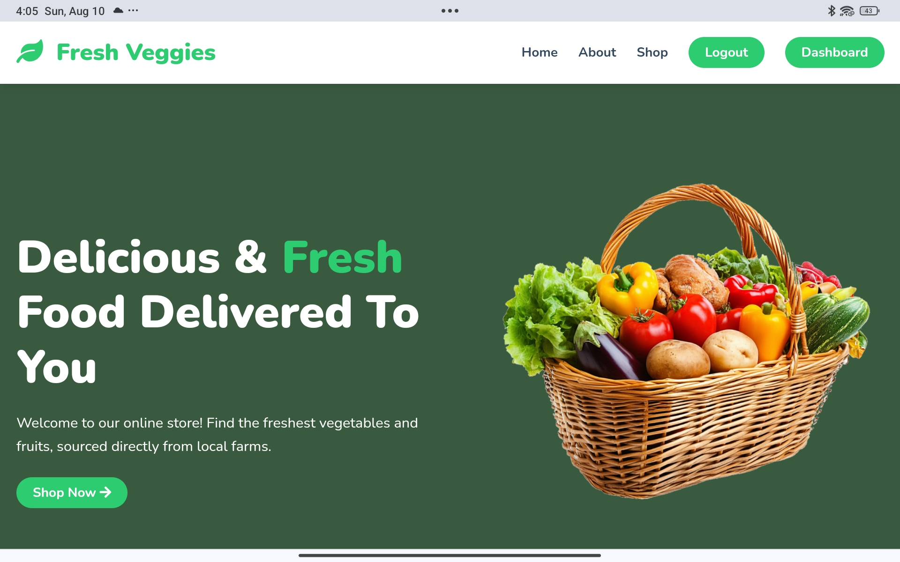
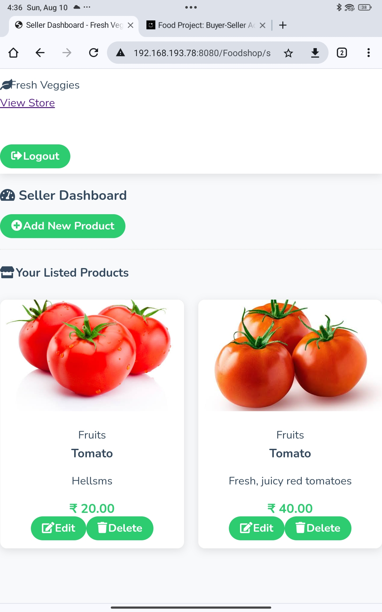

# Fresh Veggies - Online Vegetable Marketplace
[live video ](https://youtu.be/BvLPm7cu3JM?feature=shared)


Fresh Veggies is a dynamic and modern online marketplace designed to connect local farmers directly with customers. This platform empowers sellers to list their fresh produce and allows buyers to browse, filter, and purchase vegetables with ease.

Built with a robust backend using PHP and MySQL, and a responsive, attractive frontend using HTML, CSS, and JavaScript, this project is a complete solution for a small-scale e-commerce vegetable store.

---

## Features

### For Customers (Buyers):
- **Attractive Homepage:** A beautiful landing page with sliders, testimonials, and product filters.
- **Product Filtering:** Filter products by categories like "Leafy Green", "Root Vegetable", etc.
- **User-Friendly Interface:** Clean, modern, and responsive design that works on any device.
- **Secure Authentication:** Separate, secure login and registration system.

### For Farmers (Sellers):
- **Dedicated Seller Dashboard:** A private dashboard for sellers to manage their products.
- **Add New Products:** Easily add new vegetables with details like name, description, price, category, and image.
- **View Listed Products:** See all the products they have listed on the platform.

### Technical Features:
- **Dynamic Content:** All products, categories, and user data are dynamically fetched from the database.
- **Interactive UI:** Smooth animations and interactive elements using JavaScript and the Swiper.js library.
- **Secure Backend:** Uses prepared statements in PHP to prevent SQL injection attacks.
- **Organized File Structure:** A clean, modular structure separating backend logic from frontend presentation.

---

## Technology Stack

- **Frontend:** HTML5, CSS3, JavaScript (ES6)
- **Backend:** PHP
- **Database:** MySQL
- **Libraries:** Swiper.js
- **Icons:** Font Awesome

---

## Getting Started

### Prerequisites
- A web server environment like XAMPP, WAMP, or MAMP.
- MySQL database server.
- A web browser.

### Installation

1.  **Clone the repository:**
    ```sh
    git@github.com:rameshwaryadav/fresh-veggies-ecommerce.git
    ```

2.  **Move the project to your server's root directory** (`htdocs` or `www`).

3.  **Set up the database:**
    - Open phpMyAdmin.
    - Create a new database named `food_project`.
    - Import the `database.sql` file into the `food_project` database.

4.  **Configure the database connection:**
    - Open `backend/config.php`.
    - Update `root` and `root` if necessary.

5.  **Run the application:**
    - Open your browser and navigate to `http://localhost/fresh-veggies/`.

---

## Screenshots

| Login Page                               | Homepage                               | Seller Dashboard                           |
| ---------------------------------------- | -------------------------------------- | ------------------------------------------ |
|  |  |  |

---

## About The Developer

Hello! I'm [rameshwar yadav], a passionate web developer focused on creating clean, efficient, and user-friendly web applications.

- **LinkedIn:** [https://linkedin.com/in/rameshwar01]
- **GitHub:** [https://github.com/rameshwaryadav]
